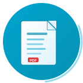

# Preview List PDF — By Showline Solutions

A professional, production-ready Odoo module that adds a **"Preview PDF"** button to every list view, generating beautifully formatted, dynamic PDF documents from any model.

---

## Features

| Feature | Description |
|---------|-------------|
| 🔍 **Dynamic Columns** | Captures exactly the columns visible in your list view |
| 📄 **Smart Pagination** | Respects current page, limit, and record count |
| 🔄 **Auto-Orientation** | Portrait/Landscape switching based on column count |
| 🖼️ **Image-Free** | Automatically filters avatars, icons, and binary fields |
| 🎨 **Professional Styling** | Teal/cyan branded headers, clean typography |
| 🔐 **License Protected** | One-time activation with auto-validation |
| ⚡ **Ultra-Fast** | Optimized for large datasets |
| 🎬 **Loading Animation** | Lottie-powered overlay with progress tracking |

---

## Installation

1. Copy the `preview_list_pdf` folder to your Odoo addons directory.
2. Update the Apps list in Odoo.
3. Search for "Preview List PDF" and click **Install**.
4. Go to **Settings → General Settings → Preview List PDF** to activate your license.

---

## Usage

1. Open any list view (Sales Orders, Contacts, Products, etc.).
2. Configure columns, filters, and pagination as needed.
3. Click the **"Preview PDF"** button in the control panel.
4. Watch the loading animation while your PDF is generated.
5. The PDF opens in a new window with Print and Download options.

---

## License

This module is licensed under **OPL-1** (Odoo Proprietary License v1.0).  
A one-time license key is required per database.

---

## Support

Developed by **Showline Solutions**  
Website: [https://showline.co.zw](https://showline.co.zw)

---

## Screenshots

| Loading Screen | PDF Output | Settings |
|:---:|:---:|:---:|
| Lottie-powered animation | Professional table layout | License activation |